<div align="center">


<br />

[](https://github.com/AlexanderGG-0520)
[](https://github.com/AlexanderGG-0520?tab=followers)

</div>

## `whoami`

```text
Student developer in Japan
Linux-first / performance-minded / infrastructure-oriented
Building software around Minecraft, rendering, containers, and compatibility
```

I enjoy working below the surface of an application: render pipelines, protocol gateways, process lifecycles, persistent storage safety, compatibility layers, and reproducible deployment.

My goal is not merely to make something run. I want to understand **why it works**, measure whether it is actually better, and make failure modes explicit.

> **Compatibility before novelty. Evidence before performance claims. Safety before automation.**

## Featured projects

<table>
<tr>
<td width="50%" valign="top">

### [Threadium](https://github.com/AlexanderGG-0520/threadium)

Experimental Fabric client optimization mod that accelerates eligible Minecraft `ModelPart` entity rendering through cached meshes, per-instance pose data, and GPU instancing.

- Safe vanilla fallback for unsupported render paths
- Differential correctness coverage
- Designed to coexist with established optimization mods
- Measured scaling improvements in dense entity scenes

</td>
<td width="50%" valign="top">

### [Minecartainer](https://github.com/AlexanderGG-0520/minecartainer)

A predictable, fail-fast Minecraft Java server container image designed for Kubernetes, GitOps, persistent volumes, and S3-compatible asset delivery.

- Minecraft-aware graceful shutdown through RCON
- Conservative persistent-volume handling
- Multiple Java runtime targets
- Fabric, Paper, Purpur, Forge, NeoForge, Velocity, and more

</td>
</tr>
<tr>
<td width="50%" valign="top">

### [AviUtl2 Linux Patches](https://github.com/AlexanderGG-0520/aviutl2-linux-patches)

Compatibility patches, reproducible build scripts, diagnostics, and an interactive setup flow for running AviUtl2 on x86_64 Linux.

- Patched Wine DirectWrite and DXVK
- Fcitx5 / Mozc Japanese input
- AV1 and NVIDIA NVDEC validation
- Provenance-aware artifact verification

</td>
<td width="50%" valign="top">

### [mc-router](https://github.com/AlexanderGG-0520/mc-router)

A Go-based Minecraft Java Edition gateway that routes one public TCP entry point to multiple backend servers using the hostname from the Minecraft handshake.

- Static and Kubernetes-discovered routing
- Prometheus metrics and structured logging
- Graceful shutdown and fail-closed behavior
- Experimental transfer-aware voice chat routing

</td>
</tr>
</table>

## What I work with

<div align="center">

### Languages and runtime


### Infrastructure and platform


### Development focus


</div>

## Engineering principles

```yaml
performance:
  - benchmark before claiming improvement
  - optimize real bottlenecks, not impressive-looking microcases

reliability:
  - fail fast when state is ambiguous
  - preserve user data and provide safe fallback paths

compatibility:
  - integrate with the existing ecosystem
  - keep unsupported behavior explicit and recoverable

workflow:
  - automate repeatable work
  - keep builds and diagnostics reproducible
```

## Current focus

- Expanding Threadium from dense-entity wins toward broader real-world Minecraft performance
- Hardening Minecraft server delivery and routing for Kubernetes environments
- Improving Windows creative software compatibility on Linux without hiding unverified assumptions
- Building development environments where Linux is treated as a first-class platform

## GitHub activity

<div align="center">









</div>

---

<div align="center">

### Build systems that are fast, observable, and difficult to break.


</div>
